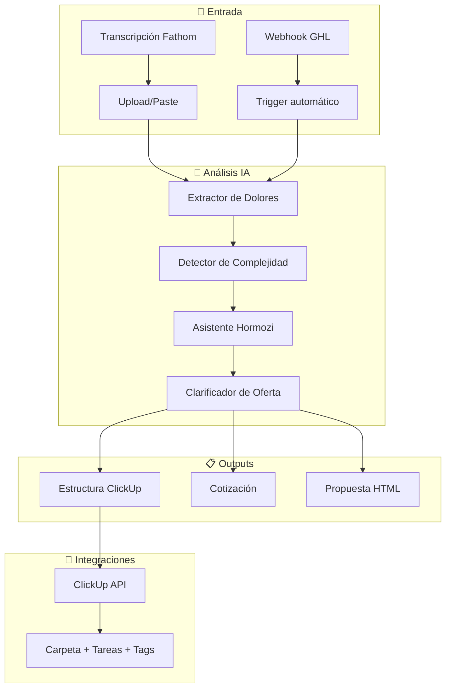

# GHL Implementation Assistant

Asistente inteligente para análisis de llamadas con clientes, detección de dolores/complejidad, generación de SOPs en ClickUp, y propuestas automatizadas para implementaciones en Go High Level.

## User Review Required

> [!IMPORTANT]
> **APIs Necesarias**: Este proyecto requiere:
> - **ClickUp API Token** - Para crear carpetas, tareas, custom fields
> - **OpenAI/Claude API Key** - Para el asistente de IA
> - ¿Prefieres OpenAI (GPT-4) o Claude para el asistente?

> [!WARNING]
> **Webhook GHL**: Para activar la app desde GHL cuando un lead cambia de etapa, necesitarás:
> - La app debe estar deployada en un servidor accesible (o usar ngrok para desarrollo)
> - Configurar el webhook en tu pipeline de GHL

---

## Arquitectura Propuesta



---

## Proposed Changes

### Frontend - Vue.js Application
> Stack simple: Vue 3 + Vite (similar a tu Theme Builder existente)

#### [NEW] [main.js](file:///c:/Users/germa/OneDrive/Documents/GHL%20Implementaciones/frontend/src/main.js)
- Entry point de la aplicación Vue

#### [NEW] [App.vue](file:///c:/Users/germa/OneDrive/Documents/GHL%20Implementaciones/frontend/src/App.vue)
- Layout principal con navegación lateral

#### [NEW] [TranscriptAnalyzer.vue](file:///c:/Users/germa/OneDrive/Documents/GHL%20Implementaciones/frontend/src/pages/TranscriptAnalyzer.vue)
- Página principal para subir/pegar transcripciones de Fathom
- Panel de chat con el asistente "Hormozi"
- Visualización de dolores detectados, complejidad, alcance

#### [NEW] [ProjectBuilder.vue](file:///c:/Users/germa/OneDrive/Documents/GHL%20Implementaciones/frontend/src/pages/ProjectBuilder.vue)
- Constructor visual del proyecto (semanas, tareas, subtareas)
- Preview antes de enviar a ClickUp
- Edición manual de elementos

#### [NEW] [ProposalGenerator.vue](file:///c:/Users/germa/OneDrive/Documents/GHL%20Implementaciones/frontend/src/pages/ProposalGenerator.vue)
- Generador de propuesta HTML
- Preview en tiempo real
- Botón de exportar/copiar

---

### Backend - Node.js + Express

#### [NEW] [server.js](file:///c:/Users/germa/OneDrive/Documents/GHL%20Implementaciones/backend/server.js)
- Servidor Express principal
- Endpoints para análisis, ClickUp, webhooks

#### [NEW] [ai-analyzer.js](file:///c:/Users/germa/OneDrive/Documents/GHL%20Implementaciones/backend/services/ai-analyzer.js)
- Servicio de análisis con IA
- Prompts especializados para:
  - Extracción de dolores
  - Evaluación de complejidad (1-10)
  - Categorización de tipo de implementación
  - Preguntas estilo Hormozi

#### [NEW] [clickup-service.js](file:///c:/Users/germa/OneDrive/Documents/GHL%20Implementaciones/backend/services/clickup-service.js)
- Integración con ClickUp API
- Crear folders, listas, tareas
- Configurar custom fields y tags

#### [NEW] [ghl-webhook.js](file:///c:/Users/germa/OneDrive/Documents/GHL%20Implementaciones/backend/routes/ghl-webhook.js)
- Endpoint para recibir webhooks de GHL
- Validación de pipeline/stage
- Trigger del flujo de análisis

---

### Templates y Configuración

#### [NEW] [proposal-template.html](file:///c:/Users/germa/OneDrive/Documents/GHL%20Implementaciones/templates/proposal-template.html)
- Template base para propuestas
- Variables dinámicas: nombre cliente, dolores, solución, precio, timeline

#### [NEW] [project-templates.json](file:///c:/Users/germa/OneDrive/Documents/GHL%20Implementaciones/config/project-templates.json)
- Templates de proyectos por tipo de implementación
- Estructura de tareas estándar por tipo:
  - Setup básico GHL
  - Automatizaciones
  - Integraciones API
  - SAAS completo
  - Custom development

#### [NEW] [prompts.json](file:///c:/Users/germa/OneDrive/Documents/GHL%20Implementaciones/config/prompts.json)
- Prompts del asistente IA
- Preguntas estilo Hormozi configurables

---

## Flujo de Usuario

### 1. Entrada de Transcripción
```
Usuario pega transcripción de Fathom
         ↓
IA analiza y extrae:
  - Dolores principales (pain points)
  - Situación actual del lead
  - Objetivos deseados
  - Complejidad estimada (1-10)
  - Tipo de implementación sugerida
```

### 2. Sesión con Asistente Hormozi
```
Asistente hace preguntas específicas:
  - "¿Cuántos leads manejas al mes actualmente?"
  - "¿Qué porcentaje se te escapa por falta de seguimiento?"
  - "¿Cuánto vale un cliente cerrado para ti?"
  - "Si pudieras automatizar X, ¿cuántas horas ahorrarías?"
         ↓
Ayuda a clarificar la oferta y el ROI
```

### 3. Generación de Proyecto
```
Sistema genera estructura en ClickUp:
  📁 [Nombre Cliente] - Implementación GHL
    └── 📋 Semana 1: Setup Inicial
        ├── ✓ Configurar cuenta
        ├── ✓ Importar contactos
        └── ✓ Setup pipelines
    └── 📋 Semana 2: Automatizaciones
        ├── ✓ Workflow seguimiento
        └── ✓ Email sequences
    └── 📋 Semana 3: Integraciones
        ...
```

### 4. Cotización y Propuesta
```
Basado en complejidad y alcance:
  - Cálculo automático de precio
  - Generación de propuesta HTML
  - Preview y edición
  - Exportar/Enviar
```

---

## Verification Plan

### Desarrollo Local
1. **Frontend**: `npm run dev` en `/frontend` - Verificar UI carga correctamente
2. **Backend**: `npm run dev` en `/backend` - Verificar servidor responde en puerto 3001
3. **Test de análisis**: Pegar transcripción sample y verificar extracción de dolores

### Testing de Integraciones
- **ClickUp**: Test con API token real, crear carpeta de prueba
- **GHL Webhook**: Usar ngrok + postman para simular webhook

### Manual Testing (por usuario)
- Flujo completo: Transcripción → Análisis → Preguntas → ClickUp → Propuesta

---

## Preguntas Pendientes

1. **¿Tienes ya tu ClickUp API Token?** Lo necesitaré para configurar la integración.

2. **¿Prefieres OpenAI (GPT-4) o Anthropic (Claude) para el asistente?**

3. **¿Tienes alguna transcripción de ejemplo de Fathom?** Me ayudaría a calibrar mejor el análisis.

4. **Para los custom fields en ClickUp**, ¿ya tienes definidos cuáles usas? (ej: Prioridad, Estado, Tipo de Tarea, etc.)

5. **¿Cuáles son las etapas de tu pipeline en GHL?** Necesito saber cuál trigger debería activar la app.
